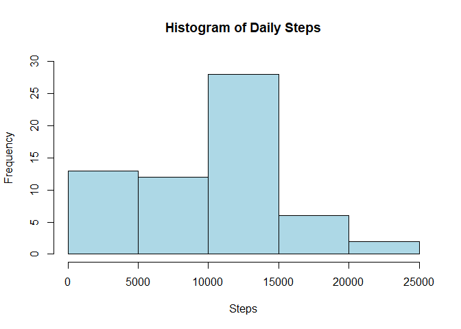
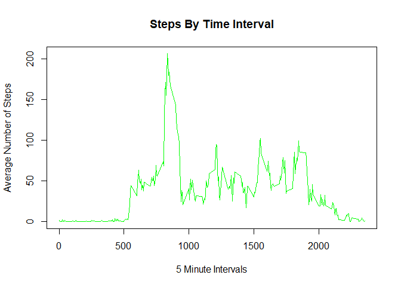
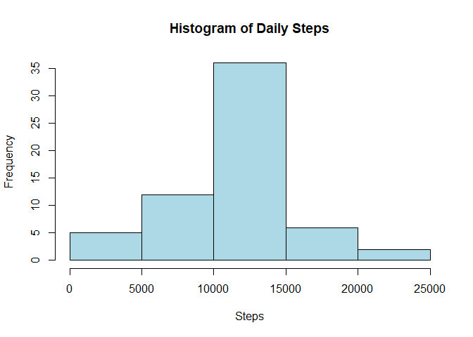
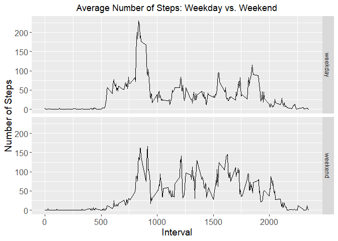

## Attach Packages:


```r
library(ggplot2)
library(dplyr)
```

```
## 
## Attachement du package : 'dplyr'
```

```
## Les objets suivants sont masqués depuis 'package:stats':
## 
##     filter, lag
```

```
## Les objets suivants sont masqués depuis 'package:base':
## 
##     intersect, setdiff, setequal, union
```

## Loading and preprocessing the data


```r
if(!file.exists("./data")){dir.create("./data")}
fileUrl <- "https://d396qusza40orc.cloudfront.net/repdata%2Fdata%2Factivity.zip"
download.file(fileUrl,destfile="./data/activity.zip",method="curl")

unzip(zipfile="./data/activity.zip",exdir="./data")
activity <- read.csv("./data/activity.csv")
activity$date <- as.Date(activity$date)
```

## What is mean total number of steps taken per day?

### Calculate the total number of steps taken per day


```r
stepsPerDay <- activity %>%
  group_by(date) %>%
  summarize(sumsteps = sum(steps, na.rm = TRUE))
```

### create a histogaram of daily steps per day


```r
hist(stepsPerDay$sumsteps, main = "Histogram of Daily Steps", 
     col="lightblue", xlab="Steps", ylim = c(0,30))
```

<!-- -->

### Calculate and report the mean and median of the total number of steps taken per day


```r
meanPreNA <- round(mean(stepsPerDay$sumsteps))
medianPreNA <- round(median(stepsPerDay$sumsteps))
print(paste("The mean is: ", meanPreNA))
```

```
## [1] "The mean is:  9354"
```

```r
print(paste("The median is :", medianPreNA))
```

```
## [1] "The median is : 10395"
```

## What is the average daily activity pattern?

### Make a time series plot of the 5-minute interval and the average number of steps taken


```r
# organizing data
stepsPerInterval <- activity %>%
  group_by(interval) %>%
  summarize(meansteps = mean(steps, na.rm = TRUE))
#create the plot
plot(stepsPerInterval$meansteps ~ stepsPerInterval$interval,
     col="green", type="l", xlab = "5 Minute Intervals", ylab = "Average Number of Steps",
     main = "Steps By Time Interval")
```

<!-- -->

### The 5-minute interval, on average across all the days in the dataset, contains the maximum number


```r
print(paste("5-Minute Interval containing the most steps on avrage:"
  ,stepsPerInterval$interval[which.max(stepsPerInterval$meansteps)]))
```

```
## [1] "5-Minute Interval containing the most steps on avrage: 835"
```

```r
print(paste("Average steps for that interval: ",round(max(stepsPerInterval$meansteps))))
```

```
## [1] "Average steps for that interval:  206"
```

## Imputing missing values

### Calculate and report the total number of missing values in the dataset


```r
print(paste("The total number of rows with NA is: ",sum(is.na(activity$steps))))
```

```
## [1] "The total number of rows with NA is:  2304"
```

###Create a new dataset that is equal to the original dataset but with the missing data filled in.


```r
dataNoNA <- activity  
for (i in 1:nrow(activity)){
        if(is.na(activity$steps[i])){
                dataNoNA$steps[i]<- stepsPerInterval$meansteps[dataNoNA$interval[i] == stepsPerInterval$interval]
        }
}
```

### Make a histogram of the total number of steps taken each day and Calculate and report the mean and median total number of steps taken per day.


```r
stepsPerDay <- dataNoNA %>%
        group_by(date) %>%
        summarize(sumsteps = sum(steps, na.rm = TRUE)) 

hist(stepsPerDay$sumsteps, main = "Histogram of Daily Steps", 
     col="lightblue", xlab="Steps")
```

<!-- -->

### Calculate and report the mean and median total number of steps taken per day.


```r
meanPostNA <- round(mean(stepsPerDay$sumsteps), digits = 2)
medianPostNA <- round(median(stepsPerDay$sumsteps), digits = 2)

print(paste("The mean is: ", mean(meanPostNA)))
```

```
## [1] "The mean is:  10766.19"
```

```r
print(paste("The median is: ", median(medianPostNA)))
```

```
## [1] "The median is:  10766.19"
```

```r
# report the diff between data with NA and without NA
NACompare <- data.frame(mean = c(meanPreNA,meanPostNA),median = c(medianPreNA,medianPostNA))
rownames(NACompare) <- c("Pre NA Transformation", "Post NA Transformation")
print(NACompare)
```

```
##                            mean   median
## Pre NA Transformation   9354.00 10395.00
## Post NA Transformation 10766.19 10766.19
```

### comment

When you include missing values for all included records you see an increase in both the mean and median. The mean increases from 9354.00 to 10766.19. And about the NA values in the first part of the project were ignored with (na.rm = TRUE).

## Are there differences in activity patterns between weekdays and weekends?

### Create a new factor variable in the dataset with two levels -- "weekday" and "weekend" indicating whether a given date is a weekday or weekend day.


```r
dataDoW <- dataNoNA
dataDoW$date <- as.Date(dataDoW$date)
dataDoW$day <- ifelse(weekdays(dataDoW$date) %in% c("Saturday", "Sunday"), "weekend", "weekday")
dataDoW$day <- as.factor(dataDoW$day)
```

### Make a panel plot containing a time series plot of the 5-minute interval and the average number of steps taken


```r
# transform the data into a factor of weekend and weedays
dataDoW <- dataNoNA
dataDoW$date <- as.Date(dataDoW$date)
dataDoW$day <- ifelse(weekdays(dataDoW$date) %in% c("samedi", "dimanche"), "weekend", "weekday")
dataDoW$day <- as.factor(dataDoW$day)
# filtring the data 
dataWeekday <- filter(dataDoW, dataDoW$day == "weekday")
dataWeekend <- filter(dataDoW, dataDoW$day == "weekend")
# calculate the mean of the steps in weekdays
dataWeekday <- dataWeekday %>%
  group_by(interval) %>%
  summarize(steps = mean(steps)) 

dataWeekday$day <- "weekday"
# calculate the mean of the steps in weekend
dataWeekend <- dataWeekend %>%
  group_by(interval) %>%
  summarize(steps = mean(steps))

dataWeekend$day <- "weekend"
# Create a dataframe with the two summarize data (weekend, weekdays)
wkdayWkend <- rbind(dataWeekday, dataWeekend)
wkdayWkend$day <- as.factor(wkdayWkend$day)
# create the plot serie-time of the 5-minute interval and the average number of steps taken

g <- ggplot (wkdayWkend, aes (interval, steps))
g + geom_line() + facet_grid (day~.) + 
  theme(axis.text = element_text(size = 12),axis.title = element_text(size = 14)) + 
  labs(y = "Number of Steps") + labs(x = "Interval") + 
  ggtitle("Average Number of Steps: Weekday vs. Weekend") + 
  theme(plot.title = element_text(hjust = 0.5))
```

<!-- -->

### Comment

The visualizations shows slight differences in the step patterns throughout the average daily intervals. Weekdays show a large spike in early morning which could coincide with people walking to work/school. While step counts on weekends are more consistent throughout the day.

# The end of the project
